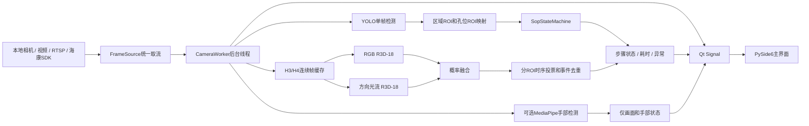
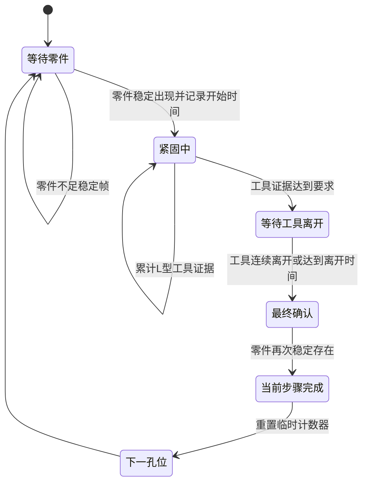

# AI SOP 项目技术交接手册

> 面向第一次接触计算机视觉、YOLO、动作识别和 PySide6 的接手人员。  
> 文档依据当前代码编写，功能基线提交：`19b21f1`。  
> 最后核对日期：2026-08-22。

## 1. 先看这一页

这个项目用于模具装配工位的固定相机监控。当前试点只有一个物理区域 `R1`，
要求按 `H1 -> H2 -> H3 -> H4 -> H5 -> H6` 的顺序安装六个孔位。

系统不是“看到零件就算完成”。一个孔位的完整流程是：

```text
当前孔位检测到零件并稳定存在
-> 该步骤开始计时
-> 检测到 L 型工具参与紧固
-> L 型工具离开
-> 零件再次稳定存在
-> 当前孔位完成，切换到下一孔位
```

项目有三条相互独立的视觉链路：

| 链路 | 技术 | 作用 | 是否影响 SOP 步骤 |
|---|---|---|---|
| 孔位装配 | YOLO + 孔位 ROI + 状态机 | 零件、L 型工具、明显锉刀 | 是 |
| 裸锉刀动作 | RGB R3D-18 + 光流 R3D-18 + 时序投票 | 包装被撕掉后，通过连续锉削动作补充报警 | 只增加异常，不改变当前孔位 |
| 手部展示 | MediaPipe Hand Landmarker | 在画面上显示手部关键点 | 否 |

最重要的交接提醒：`dataset/`、`runs/`、模型权重、MediaPipe 模型和海康 DLL
都被 `.gitignore` 排除。只从 GitHub 拉代码，客户端不能完整运行，必须同时移交
“运行资产”，详见第 8 节。

## 2. 项目边界

### 2.1 当前已经实现

- PySide6 原生桌面客户端，不需要浏览器。
- 本地摄像头、视频文件、RTSP 和 Windows 海康 SDK 取流。
- YOLO 三类目标检测：`installed_part`、`l_tool_visible`、`forbidden_tool`。
- 固定 ROI 下的孔位映射和区域串行 SOP。
- 零件落位、紧固工具证据、工具离开、最终零件确认。
- 顺序异常、禁止工具异常以及异常去重。
- 每个孔位从零件稳定落位到步骤完成的耗时。
- 实际已安装孔位数量统计。
- RGB 与方向光流双模型的裸锉刀连续动作报警。
- 可选 MediaPipe 手部关键点展示。
- 视频抽帧、LabelMe 转 YOLO、孔位 ROI 和动作 ROI 标定工具。
- 单元测试及离线完整视频测试脚本。

### 2.2 当前没有实现

- 不判断零件型号是否正确。当前所有零件统一视为 `installed_part`。
- 不通过手势决定步骤完成，手部关键点只是展示。
- 没有可靠的工件开始、结束、下一工件自动复位闭环。
- `missing_timeout_frames` 当前为 `0`，所以纯粹“最后漏了某孔位”不会仅靠等待自动结算。
- 客户端的 `开始监控`、`暂停监控`、`恢复监控`、`结束/复位`、`异常确认`
  目前是界面预留按钮，没有接入真实业务控制。
- 桌面客户端异常列表目前只在内存和界面中，退出后不会自动保存到数据库。
- 当前没有账号权限、MES 接口、工单绑定和集中式设备管理。

维护或汇报时必须区分“已实现”和“规划中”，不要把上面未实现的能力当作现状。

## 3. 基础术语

| 术语 | 本项目中的含义 |
|---|---|
| `R1` | 当前试点的物理监控区域 |
| `H1`～`H6` | R1 内六个孔位，同时代表 SOP 的先后步骤 |
| ROI | 画面中的关注区域，使用 0～1 归一化坐标 `[x1, y1, x2, y2]` |
| 区域总 ROI | 整片作业区域，用于过滤区域外目标和匹配移动工具 |
| 孔位 ROI | H1～H6 的小区域，用于把零件检测框映射到具体孔位 |
| 动作 ROI | H3/H4 附近的大区域，用于裁剪连续动作视频，不参与孔位映射 |
| 检测帧 | 实际执行一次 YOLO 推理的帧，不一定等于摄像头的每一帧 |
| 稳定帧 | 连续多个检测帧满足条件，用于过滤单帧误检 |
| RGB 模型 | 读取连续彩色画面，学习工具、手和场景外观 |
| 光流模型 | 读取连续帧的水平/垂直运动方向和强度，学习往复动作 |
| 状态机 | 根据每帧检测结果维护“现在应该装哪个孔位、进行到哪个阶段” |
| 权重 | 训练得到的 `.pt` 模型文件 |

## 4. 系统架构



### 4.1 为什么模型放在后台线程

Qt 主线程负责窗口绘制和鼠标事件。如果在主线程运行 YOLO 或 R3D-18，窗口会
冻结。`desktop_app.py` 中的 `CameraWorker` 在独立 `QThread` 中完成取流和推理，
再通过 Signal 把图像及普通状态字典传回主线程。

### 4.2 为什么实时取流只保留最新帧

现场监控关心“此刻发生什么”。如果模型处理速度低于相机帧率，旧帧不断排队会
造成延迟越来越大。因此 RTSP 和海康 SDK 后端允许丢掉旧帧，只保存最新帧。

离线视频不同：它需要完整复现并使用原视频时间戳，所以不能按实时流方式随意
跳过播放节奏。客户端会根据视频时间戳控制正常速度播放，导出模式则按源时间处理。

## 5. SOP 核心业务逻辑

### 5.1 单孔位状态流



关键原因：零件刚放进孔位只代表步骤开始。现场还需要用 L 型工具拧紧，所以必须
在看到工具参与、工具离开、零件最终仍在后，才能确认步骤完成。

为适应连续操作，如果当前步骤已经有零件和工具证据，且紧邻的下一孔位零件随后
稳定出现，状态机也可以把它视为操作员已经完成转序：先完成当前步骤，再以该零件
第一次稳定候选的时间作为下一步骤起点。这个分支仍要求下一孔位满足稳定帧，不会
由单帧误检直接推进。

### 5.2 顺序异常

状态机始终保存一个 `expected_step`。例如当前应装 H1，却稳定检测到 H2：

1. 记录一次 `ORDER_ERROR`。
2. H2 仍计入“实际已装孔位”。
3. 当前期望步骤仍是 H1，不会因为 H2 出现就直接跳到 H3。
4. H1 后续完成后，已经确认提前安装的 H2 可以跳过，避免流程永久卡死。
5. 同一个期望步骤的重复画面不会无限重复累计同一错序异常。

如果界面出现“H1 后放 H2 却仍报错序”，通常不是顺序表写错，而是 H1 尚未走完
工具证据和最终确认，状态机仍认为当前期望孔位是 H1。

### 5.3 漏装

当前配置 `missing_timeout_frames = 0`，即关闭固定等待超时漏装。原因是现场操作时间
不稳定，仅凭等了多少秒无法可靠判断“漏装”还是“操作较慢”。

目前更可靠的漏装证据来自后续孔位提前出现。例如应装 H2 时直接出现 H3，会先按
错序记录。完整的“工件周期结束时统一核对缺少哪些孔位”仍是后续待开发能力。

### 5.4 明显锉刀报警

YOLO 检测到 `forbidden_tool` 后，需要连续达到配置中的稳定证据才报警。报警锁存
期间不会每帧重复计数；目标持续消失达到清除帧数或清除时间后，才允许下一次报警。

禁止工具按区域总 ROI 匹配，不按孔位小 ROI 匹配。锉刀在 H3/H4 周围移动时可能
暂时跨出某个孔位小框，如果使用孔位 ROI 会造成明显漏报。

### 5.5 裸锉刀连续动作报警

当锉刀黄色包装被撕掉后，单帧外观可能和普通金属工具相似。补充方案是：

```text
H3/H4动作ROI连续缓存约2.4秒
-> RGB模型输出锉削概率
-> 方向光流模型输出锉削概率
-> 默认按 RGB 0.7 + 光流 0.3 融合
-> H3、H4分别进行4窗口内3票触发
-> 任一ROI触发后合并成一次全局异常
-> 连续4个窗口低于解除阈值后结束事件
```

H3 和 H4 必须独立投票。不能把 H3 的两个高分和 H4 的一个高分拼成三票，否则会
在没有真实锉削时产生跨区域误报警。

动作报警只增加异常次数和异常记录，不修改 `SopStateMachine` 的当前孔位。

### 5.6 当前界面统计口径

- `加工量`：当前稳定确认已经装入零件的孔位数。
- `正常`：当前实现与加工量相同，也是稳定确认的已装孔位数。
- `异常`：错序、漏装、明显锉刀和连续锉削事件的累计次数。
- 异常是事件数，不从正常数或加工量中扣除，所以 `加工量` 不要求等于
  `正常 + 异常`。
- 环形图显示已装孔位数/计划孔位数，不是良率饼图。

## 6. 代码目录和文件职责

### 6.1 核心运行代码

| 文件 | 作用 | 新人建议阅读顺序 |
|---|---|---|
| `sop_monitor/models.py` | 配置、检测帧、业务事件的数据结构 | 1 |
| `sop_monitor/config.py` | 把 SOP JSON 转成类型对象 | 2 |
| `sop_monitor/state_machine.py` | 顺序、紧固、完成和异常的核心业务逻辑 | 3 |
| `sop_monitor/camera_utils.py` | 相机参数、ROI 映射、画框工具 | 4 |
| `sop_monitor/camera_monitor.py` | YOLO 推理结果转为 `Detection`；也保留 CLI 调试入口 | 5 |
| `sop_monitor/camera_source.py` | OpenCV、RTSP、海康 SDK 的统一取流层 | 6 |
| `sop_monitor/action_recognition.py` | 动作 ROI、RGB/光流预处理、融合和时序投票 | 7 |
| `sop_monitor/action_runtime.py` | 客户端实时双动作模型加载、缓存和推理 | 8 |
| `sop_monitor/hand_detector.py` | MediaPipe 手部关键点展示 | 9 |
| `sop_monitor/desktop_app.py` | PySide6 客户端、后台线程、表格和异常记录 | 10 |

### 6.2 辅助入口

| 文件 | 作用 |
|---|---|
| `sop_monitor/camera_preview.py` | 不加载模型的简单摄像头预览 |
| `sop_monitor/cli.py` | 用 JSONL 输入验证状态机，不需要摄像头和 YOLO |
| `sop_monitor/detector.py` | 读取 JSONL 模拟检测结果 |
| `sop_monitor/event_log.py` | 把事件写成 JSONL |

### 6.3 数据和训练脚本

| 文件 | 作用 |
|---|---|
| `scripts/extract_frames.py` | 从现场视频按时间间隔抽取图片 |
| `scripts/labelme_to_yolo.py` | 把 LabelMe 检测框转换成 YOLO 数据集 |
| `scripts/roi_calibrator.py` | 标定区域总 ROI 和 H1～H6 孔位 ROI |
| `scripts/action_roi_calibrator.py` | 标定 H3/H4 大动作 ROI |
| `scripts/extract_action_windows.py` | 从完整正常视频切出 `other_action` 困难负样本 |
| `scripts/train_action_classifier.py` | 训练 RGB 或光流 R3D-18 动作模型 |
| `scripts/test_action_video.py` | 双动作模型测试，输出视频、逐窗口概率和事件表 |
| `scripts/env.sh` | macOS/Linux 本地缓存环境变量 |

### 6.4 配置文件

| 文件 | 使用场景 |
|---|---|
| `configs/sample_sop.json` | 无 ROI 的配置模板，只适合开始标定或状态机回放 |
| `configs/calibrated_sop.json` | 原现场画面的 R1/H1～H6 正式 ROI |
| `configs/calibrated_sop_bare_file.json` | 新测试视频专用，H2 ROI 有偏移且工具证据为 3 帧 |
| `configs/action_rois.json` | 当前 H3/H4 连续动作模型使用的大 ROI |

旧视频必须继续使用与它匹配的旧配置。不要为了新视频方便而覆盖正式配置。

### 6.5 测试

| 文件 | 主要覆盖 |
|---|---|
| `tests/test_state_machine.py` | 完成、错序、漏装、工具、耗时、去重 |
| `tests/test_camera_utils.py` | ROI 映射、RTSP 参数、可见框 |
| `tests/test_camera_source.py` | 海康通道和后端边界 |
| `tests/test_hand_detector.py` | 手部框与 ROI 关系 |
| `tests/test_roi_calibrator.py` | ROI 坐标和单孔位重画 |
| `tests/test_action_recognition.py` | 光流、融合、分 ROI 投票和动作缓存采样 |

## 7. 环境准备

### 7.1 推荐现场环境

- Windows 10/11 64 位。
- Python 3.11 64 位。不要优先使用刚发布的新 Python 大版本。
- Git。
- NVIDIA 显卡及匹配的官方驱动。
- CUDA 版 PyTorch。一般不需要单独安装完整 CUDA Toolkit，PyTorch wheel 会携带
  对应运行库，但必须有兼容的 NVIDIA 驱动。
- Microsoft Visual C++ 2015-2022 Redistributable x64，建议安装。
- 海康 Windows 64 位 SDK 运行 DLL。
- FFmpeg 仅在视频损坏、H.264 解码报错或需要切片时使用，不是客户端每天运行的必需项。

### 7.2 Windows PowerShell 安装

在项目根目录执行：

```powershell
py -3.11 -m venv .venv
Set-ExecutionPolicy -Scope Process Bypass
.\.venv\Scripts\Activate.ps1
python -m pip install --upgrade pip
python -m pip install torch torchvision torchaudio --index-url https://download.pytorch.org/whl/cu128
python -m pip install -r requirements-windows.txt
```

`cu128` 是当前项目文档中的示例。更换驱动或 PyTorch 大版本时，应按 PyTorch
官方安装页生成命令，不要机械复制旧命令。

验证：

```powershell
python --version
python -c "import torch; print('CUDA可用:', torch.cuda.is_available()); print('显卡:', torch.cuda.get_device_name(0) if torch.cuda.is_available() else '无')"
python -c "import cv2, PySide6, ultralytics; print('核心库导入正常')"
```

动作训练还应安装：

```powershell
python -m pip install -r requirements-action-windows.txt
```

### 7.3 macOS 开发/离线验证

```bash
python3 -m venv .venv
.venv/bin/python -m pip install --upgrade pip
.venv/bin/python -m pip install -r requirements.txt
source scripts/env.sh
```

Mac 可以运行单元测试、标定、视频测试和 CPU 推理。当前项目的现场海康 SDK 后端
只支持 Windows；双 R3D-18 加 YOLO 在 Mac CPU 上会很慢，不代表 Windows GPU
现场性能。

## 8. 必须单独移交的运行资产

Git 仓库只保存代码和配置。至少准备下面的目录结构：

```text
AI-SOP/
├── runs/
│   ├── sop_objects_v1/weights/best.pt
│   ├── filing_action_rgb_fusion_v1/best.pt
│   └── filing_action_flow_fusion_v1/best.pt
├── models/
│   └── hand_landmarker.task              # 只有开启手部展示时需要
├── third_party/hikvision/
│   ├── HCNetSDK.dll
│   ├── PlayCtrl.dll
│   ├── HCCore.dll
│   ├── hpr.dll
│   ├── libcrypto-*.dll
│   ├── libssl-*.dll
│   └── SDK要求的其他依赖和子目录
├── configs/
│   ├── calibrated_sop.json
│   ├── calibrated_sop_bare_file.json
│   └── action_rois.json
└── dataset/                                # 仅训练或复现实验时需要
```

当前本机关键文件大小约为：

| 文件 | 大小 |
|---|---:|
| YOLO `best.pt` | 23 MB |
| RGB 动作 `best.pt` | 127 MB |
| 光流动作 `best.pt` | 127 MB |
| MediaPipe 手部模型 | 7.5 MB |

海康 SDK 不要只复制 `HCNetSDK.dll` 和 `PlayCtrl.dll` 两个文件。登录或解码失败时，
经常是 SDK 附带的依赖 DLL 或组件目录没有一起复制。具体清单以下载版本自带文档为准。

建议移交时同时保存：

- 模型文件日期、大小和 SHA256。
- 与模型对应的配置文件。
- 训练使用的代码提交号。
- 训练数据版本或只读备份位置。
- 一段已知正常视频和一段已知异常视频。
- 离线测试产生的 `predictions.csv`、`events.csv` 和演示视频。

Windows 计算 SHA256：

```powershell
Get-FileHash runs\sop_objects_v1\weights\best.pt -Algorithm SHA256
Get-FileHash runs\filing_action_rgb_fusion_v1\best.pt -Algorithm SHA256
Get-FileHash runs\filing_action_flow_fusion_v1\best.pt -Algorithm SHA256
```

## 9. 第一次启动

以下命令都要求当前目录是项目根目录，即可以看到 `README.md` 和 `sop_monitor`。

### 9.1 先跑单元测试

Windows：

```powershell
.\.venv\Scripts\Activate.ps1
python -m unittest discover -s tests -v
```

macOS：

```bash
source scripts/env.sh
.venv/bin/python -m unittest discover -s tests -v
```

当前基线应通过 50 项测试。

### 9.2 只看视频，不加载模型

```powershell
python -m sop_monitor.desktop_app `
  --config configs\calibrated_sop_bare_file.json `
  --camera dataset\action_test\bare_file_full_test.mp4
```

如果这一步打不开，先处理 Python、PySide6 或视频路径，不要先怀疑模型。

### 9.3 加载 YOLO 测试孔位 SOP

```powershell
python -m sop_monitor.desktop_app `
  --config configs\calibrated_sop_bare_file.json `
  --camera dataset\action_test\bare_file_full_test.mp4 `
  --model runs\sop_objects_v1\weights\best.pt `
  --conf 0.35 `
  --detect-interval 3
```

### 9.4 加载 YOLO 和双动作模型

```powershell
python -m sop_monitor.desktop_app `
  --config configs\calibrated_sop_bare_file.json `
  --camera dataset\action_test\bare_file_full_test.mp4 `
  --model runs\sop_objects_v1\weights\best.pt `
  --conf 0.35 `
  --detect-interval 3 `
  --action-rgb-model runs\filing_action_rgb_fusion_v1\best.pt `
  --action-flow-model runs\filing_action_flow_fusion_v1\best.pt `
  --action-device cuda `
  --action-interval 0.2 `
  --action-rgb-weight 0.7 `
  --action-threshold 0.5 `
  --action-clear-threshold 0.35 `
  --action-vote-window 4 `
  --action-trigger-votes 3 `
  --action-clear-windows 4
```

RGB 和光流模型必须同时提供。只传一个会直接报错，这是为了避免把不完整的融合
结果误当成正式结果。

### 9.5 Windows 海康 SDK 现场启动

```powershell
python -m sop_monitor.desktop_app `
  --camera-backend hikvision-sdk `
  --hikvision-sdk-dir third_party\hikvision `
  --hikvision-ip 192.168.114.222 `
  --hikvision-user admin `
  --hikvision-password "现场密码" `
  --hikvision-port 8000 `
  --hikvision-channel 101 `
  --config configs\calibrated_sop.json `
  --model runs\sop_objects_v1\weights\best.pt `
  --conf 0.35 `
  --action-rgb-model runs\filing_action_rgb_fusion_v1\best.pt `
  --action-flow-model runs\filing_action_flow_fusion_v1\best.pt `
  --action-device cuda `
  --action-interval 0.2
```

- `101` 通常是第 1 通道主码流。
- `102` 通常是第 1 通道子码流。
- 主码流更清晰但解码和推理负担更大；子码流更流畅但小零件特征可能减少。
- 摄像头密码不要写进 Git、README、批处理文件或群消息。命令行也可能被历史记录
  保存，正式部署应进一步改成受控配置或系统凭据。

### 9.6 开启手部展示

在客户端命令末尾增加：

```text
--hands --hand-model models/hand_landmarker.task --hand-interval 5
```

现场戴手套时 MediaPipe 可能漏检。即使手部模型失败，YOLO 和 SOP 仍应继续工作。

### 9.7 导出完整客户端演示视频

该模式不弹窗，会把客户端画面写成 MP4：

```bash
source scripts/env.sh
.venv/bin/python -m sop_monitor.desktop_app \
  --config configs/calibrated_sop_bare_file.json \
  --camera dataset/action_test/bare_file_full_test.mp4 \
  --model runs/sop_objects_v1/weights/best.pt \
  --conf 0.35 \
  --detect-interval 3 \
  --action-rgb-model runs/filing_action_rgb_fusion_v1/best.pt \
  --action-flow-model runs/filing_action_flow_fusion_v1/best.pt \
  --action-device cpu \
  --action-interval 1.0 \
  --export-client-video runs/client_demo.mp4 \
  --export-fps 10 \
  --export-width 1440 \
  --export-height 900
```

Mac CPU 导出很慢是正常现象。Windows GPU 可把 `--action-device cpu` 改成 `cuda`，
并把 `--action-interval` 恢复为 `0.2`。

## 10. 配置参数怎么理解

### 10.1 YOLO 与 SOP 参数

| 参数 | 当前值 | 含义 |
|---|---:|---|
| 客户端 `--conf` | 0.35 | YOLO 原始预测的最低入口阈值 |
| `confidence_threshold` | 0.5 | 零件参与稳定确认的业务阈值 |
| `stable_frames_required` | 8 | 零件或未来孔位需要稳定的检测帧数 |
| `tool_confidence_threshold` | 0.5 | L 型工具证据阈值 |
| `tool_evidence_frames_required` | 5，视频专用配置为 3 | 进入最终完成前至少积累多少个工具检测帧 |
| `tool_leave_frames_required` | 5 | 无可靠时间戳时的工具离开回退帧数 |
| `tool_leave_timeout_ms` | 4500 | 有时间戳时，工具最后出现后等待多久进入最终确认 |
| `forbidden_tool_confidence_threshold` | 0.5 | 明显锉刀业务报警阈值 |
| `display_forbidden_tool_confidence_threshold` | 0.4 | 红框展示候选阈值，最终仍需报警状态成立 |
| `forbidden_tool_stable_frames_required` | 3 | 明显锉刀连续稳定证据 |
| `forbidden_tool_clear_timeout_ms` | 5000 | 明显锉刀消失多久后允许下一次报警 |
| `missing_timeout_frames` | 0 | 关闭固定等待漏装报警 |

`--conf` 不是所有业务阈值。客户端会用足够低的入口阈值取出三类候选框，状态机
再按配置中的类别阈值做业务确认。

`stable_frames_required` 统计的是检测帧。离线视频设置 `--detect-interval 3` 后，
8 个稳定检测帧大致跨越 24 个原始视频帧；因此改变推理间隔也会改变实际确认时间。

### 10.2 动作参数

| 参数 | 当前推荐值 | 含义 |
|---|---:|---|
| 采样帧数 | 24 | 单个动作窗口帧数 |
| 采样帧率 | 10 FPS | 动作模型目标时间采样率 |
| 窗口长度 | 约 2.4 秒 | 24/10 |
| 输入尺寸 | 160×160 | 每个动作 ROI 缩放尺寸 |
| RGB 权重 | 0.7 | 融合时 RGB 概率占比 |
| 光流权重 | 0.3 | 融合时方向光流概率占比 |
| 触发阈值 | 0.5 | 单窗口阳性阈值 |
| 投票 | 4 窗口中 3 票 | 降低单窗口误报 |
| 解除阈值 | 0.35 | 低于该值才累计解除证据 |
| 解除窗口 | 4 | 连续低分后结束同一次事件 |

由于窗口本身约 2.4 秒，还要进行连续投票，报警比真实动作开始晚约 1～3 秒通常
属于算法设计延迟。若延迟明显更长，再检查 GPU、推理间隔和训练样本。

## 11. ROI 的三种用途

### 11.1 区域总 ROI

- 覆盖整片需要监控的模具区域。
- 过滤画面其他位置的相似零件。
- L 型工具和明显锉刀是移动目标，只要求中心进入区域总 ROI。

### 11.2 H1～H6 孔位 ROI

- 每个孔位一个小框。
- YOLO 框中心落入哪个孔位 ROI，就把该零件映射到哪个孔位。
- ROI 本身不会显示在正式客户端，只作为后台坐标规则。

重新标定全部孔位：

```powershell
python scripts\roi_calibrator.py `
  --image dataset\calibration\reference.png `
  --config configs\sample_sop.json `
  --output configs\calibrated_sop_new.json
```

只修正新视频中的 H2，并保留其他孔位：

```powershell
python scripts\roi_calibrator.py `
  --video dataset\action_test\bare_file_full_test.mp4 `
  --timestamp 140 `
  --config configs\calibrated_sop.json `
  --output configs\calibrated_sop_bare_file.json `
  --only-hole H2
```

### 11.3 H3/H4 动作 ROI

- 比孔位 ROI 大，包含孔位、手、L 型工具和锉刀往复轨迹。
- 只在连续动作模型内部裁剪。
- 当前不绘制到客户端。
- RGB 和光流权重中保存了动作 ROI，两个权重必须一致。

```powershell
python scripts\action_roi_calibrator.py `
  --source dataset\action_test\bare_file_full_test.mp4 `
  --timestamp 20 `
  --output configs\action_rois.json
```

相机位置、角度、焦距、画面裁切或模具位置改变后，要重新检查全部三类 ROI。
只是测试视频有轻微偏移时，应另存新配置，不要覆盖旧配置。

## 12. YOLO 数据与训练

### 12.1 标注类别

| 类别 | 怎么框 |
|---|---|
| `installed_part` | 框实际可见的已装零件，不框整个孔位 ROI |
| `l_tool_visible` | 框可见的 L 型工具金属部分，不把手一起框入 |
| `forbidden_tool` | 框可见的锉刀工具部分，不把手一起框入 |

工具被手遮挡、只露出一部分时，只要人还能合理判断是该工具，就框可见部分；
完全无法识别时不强行标注。零件和工具重叠时分别画各自可见目标框，框允许重叠。

没有任何目标的图片应作为负样本保留。LabelMe JSON 可以不存在或为空，转换脚本
会生成空 YOLO 标签。

### 12.2 推荐数据流程

```text
固定现场相机录制标准视频
-> 每秒约2帧抽PNG
-> 人工筛掉模糊、重复和无效帧
-> LabelMe画三类目标框
-> 转YOLO目录
-> 训练
-> 用未参与训练的完整视频验收
```

抽帧：

```powershell
python scripts\extract_frames.py dataset\raw_videos\normal\1.mp4 `
  --output dataset\frames_sop_png `
  --interval 0.5 `
  --prefix normal_1 `
  --ext png
```

转换：

```powershell
python scripts\labelme_to_yolo.py `
  --input dataset\sop_png `
  --output dataset\yolo_sop_objects `
  --val-ratio 0.2 `
  --seed 42
```

训练：

```powershell
yolo detect train model=yolov8n.pt data=dataset\yolo_sop_objects\data.yaml imgsz=640 epochs=50 batch=8 workers=0 device=0 project=runs name=sop_objects_v2
```

显存不足先减小 `batch`，不要先降低图片尺寸。新权重必须另建版本目录，不要直接
覆盖当前 `sop_objects_v1`。

## 13. 连续动作数据与训练

### 13.1 数据目录就是标签

```text
dataset/action_videos_fixed/
├── filing_action/          # 裸锉刀锉削
├── normal_tightening/      # 正常L型工具紧固
└── other_action/           # 放件、拿取、遮挡、调整等困难负样本
```

动作视频不需要逐帧画框。每段视频应尽量只包含一种明确动作，建议约 3～6 秒。
不确定的视频先放到单独目录人工复核，不要强行塞入训练类别。

当前脚本按每个类别分别随机划分 80%/10%/10%，并把明细保存到
`dataset_split.csv`。如果多段视频是从同一长视频连续切出的近重复片段，随机划分
可能造成数据泄漏；正式扩充数据时应按原始录制批次隔离训练和测试。

### 13.2 训练 RGB

```powershell
python scripts\train_action_classifier.py `
  --data dataset\action_videos_fixed `
  --output runs\filing_action_rgb_fusion_v2 `
  --input-mode rgb `
  --label-mode three-class `
  --epochs 30 `
  --batch-size 4 `
  --frames 24 `
  --sample-fps 10 `
  --action-rois configs\action_rois.json `
  --seed 42 `
  --device cuda
```

### 13.3 训练光流

```powershell
python scripts\train_action_classifier.py `
  --data dataset\action_videos_fixed `
  --output runs\filing_action_flow_fusion_v2 `
  --input-mode flow `
  --label-mode three-class `
  --epochs 30 `
  --batch-size 4 `
  --frames 24 `
  --sample-fps 10 `
  --action-rois configs\action_rois.json `
  --seed 42 `
  --device cuda
```

两条命令只能改变 `--input-mode` 和输出目录。数据、ROI、seed、frames、sample-fps
必须相同，否则客户端融合没有可比基础。

### 13.4 完整视频验收

```powershell
python scripts\test_action_video.py `
  --rgb-model runs\filing_action_rgb_fusion_v2\best.pt `
  --flow-model runs\filing_action_flow_fusion_v2\best.pt `
  --source dataset\action_test\bare_file_full_test.mp4 `
  --output runs\filing_action_fusion_test_v2 `
  --rgb-weight 0.7 `
  --threshold 0.5 `
  --clear-threshold 0.35 `
  --stride-seconds 0.2 `
  --vote-window 4 `
  --alarm-windows 3 `
  --clear-windows 4 `
  --device cuda
```

输出：

- `result.mp4`：测试画面和报警状态。
- `predictions.csv`：每个时间窗口的 RGB、光流、融合概率及 H3/H4 明细。
- `events.csv`：去重后的动作事件起止时间。

当前已知测试视频中，真实锉削大约发生在 `24～42 秒` 和 `73～94 秒`。验收重点
不是随机验证集 `acc` 是否为 1，而是：

1. `events.csv` 是否有且仅有两条主要事件。
2. 两条事件是否分别与真实区间重叠。
3. 其他时段是否没有明显误报。

## 14. 海康取流说明

### 14.1 推荐优先级

1. Windows 现场优先 `hikvision-sdk`。
2. SDK 暂不可用时，用 OpenCV + RTSP 做功能验证。
3. 本地 USB 摄像头用 `--camera 0`、`1`、`2`。
4. 离线视频把 `--camera` 直接写成文件路径。

### 14.2 101 与 102

- `101`：第 1 通道主码流，通常分辨率更高。
- `102`：第 1 通道子码流，通常延迟和算力占用更低。

选择原则不是只看海康网页预览是否流畅。必须在完整客户端同时加载 YOLO 和动作
模型后，检查小零件检测率、端到端延迟和 GPU 占用。

### 14.3 SDK 生命周期

`camera_source.py` 内部大致按下面顺序执行：

```text
加载 HCNetSDK.dll / PlayCtrl.dll
-> 初始化 SDK
-> 登录相机 8000 端口
-> RealPlay_V40 接收压缩码流
-> PlayCtrl 解码
-> 回调中转换为 BGR 帧
-> 只缓存最新帧
-> 客户端关闭时停止预览、注销、释放端口和SDK
```

不要把 SDK 登录、回调或 DLL 路径重新写到 `desktop_app.py`，取流细节必须留在
`camera_source.py`。

## 15. 常见问题排查

| 现象 | 优先检查 | 处理方式 |
|---|---|---|
| `No module named sop_monitor` | 当前目录不对 | `cd` 到能看到 `sop_monitor` 的项目根目录再运行 |
| `No module named ...` | 虚拟环境未激活或依赖未装 | 激活 `.venv`，用 `python -m pip` 安装对应 requirements |
| `CUDA可用: False` | PyTorch 装成 CPU 版或驱动不兼容 | 重装匹配驱动的 CUDA PyTorch wheel |
| 客户端打开但视频黑屏 | 源路径、相机权限、IP/网段 | 先只运行视频/预览，不加载模型 |
| 海康 SDK 找不到 DLL | DLL 目录不完整或位数错误 | 使用 Windows 64 位 SDK，并复制依赖和组件目录 |
| 海康登录失败 | IP、账号、密码、8000端口 | 用海康工具确认参数，检查相机 SDK 服务和网络 |
| RTSP 延迟不断增加 | 旧帧排队或网络抖动 | 确认使用最新帧后端；现场优先海康 SDK |
| 画面流畅，模型后很卡 | CPU 推理、主码流过大、动作间隔太短 | 确认 CUDA；测试 102；提高动作间隔；检查 GPU 利用率 |
| H2 一直检测不到 | 孔位 ROI 与视频偏移 | 使用该视频专用配置，或只重画 H2 另存配置 |
| 零件有绿框但步骤不完成 | 缺少 L 型工具证据或工具未离开 | 查看当前阶段和工具检测，不要只看零件框 |
| H1 后放 H2却报错序 | H1 尚未被状态机确认完成 | 检查 H1 工具证据、最终零件确认和配置阈值 |
| 空孔偶尔有绿框 | 零件模型误检 | 补空孔/弹簧困难负样本，检查 8 稳定检测帧是否真的满足 |
| 弹簧短暂出现锉刀红框 | `forbidden_tool` 外观误检 | 红框已与稳定报警绑定；仍触发时补弹簧负样本重训 |
| 明显锉刀进入后红框晚 | 模型缺少刚入画、横向或遮挡样本 | 补这些姿态，不要只靠降低阈值 |
| 裸锉刀动作不报警 | ROI、模型配对、阈值或样本差异 | 先看 `predictions.csv` 的 H3/H4 RGB/flow 明细 |
| 动作在正常阶段误报 | 困难负样本不足 | 补同区域正常紧固、放件、遮挡和调整动作 |
| H.264 `missing picture` | 原短视频切片损坏或关键帧问题 | 用 FFmpeg 重编码到新目录后再训练 |
| 手部没有关键点 | 模型缺失、手套、检测间隔 | 确认 `.task` 文件；手套场景不要依赖它做业务判定 |
| GitHub 代码缺模型/数据 | `.gitignore` 按设计排除了大文件 | 从交接资产盘单独复制，不要误认为仓库损坏 |

### 15.1 H.264 警告的处理

如果 OpenCV 报大量 `missing picture in access unit` 或 `error while decoding MB`，
可用 FFmpeg 转成标准 H.264：

```powershell
& C:\ffmpeg\bin\ffmpeg.exe -i input.mp4 -c:v libx264 -pix_fmt yuv420p -an output_fixed.mp4
```

先确认 `output_fixed.mp4` 能完整播放，再放入训练目录。不要覆盖原始数据。

## 16. 现场每日检查

开机后按顺序做：

1. 确认相机支架、角度、焦距和模具位置没有变化。
2. 确认工控机与相机在同一可访问网段。
3. 启动客户端，检查画面没有明显延迟、黑屏或裁切。
4. 确认顶部当前区域为 `R1`，当前孔位为 `H1`。
5. 用一个已知零件快速确认检测框位置。
6. 完成一次标准 H1 流程，确认状态进入 H2，而不是零件刚放下就跳转。
7. 在允许的测试条件下验证一次明显锉刀或使用离线异常视频。
8. 记录当天使用的代码提交、配置和模型版本。

相机被碰动后不要直接调置信度。第一步应把当前画面与标定参考图对比，检查 ROI。

## 17. 修改代码时的规则

### 17.1 修改业务顺序

- 优先修改/新增 JSON 配置，不要把 H1～H6 写死进状态机。
- 新区域按配置数组顺序执行。
- 新孔位必须有唯一 `hole_id` 和正确 ROI。
- 修改后至少补状态机单元测试。

### 17.2 更换相机或模具

- 保存旧配置。
- 用新画面重新标定区域和孔位 ROI。
- 检查现有 YOLO 是否还能识别新外观。
- 动作区域变化时重标动作 ROI，并重新训练 RGB/光流模型。

### 17.3 增加新模型类别

- 同步更新标注规范、YOLO `data.yaml`、配置类名和可见框规则。
- 明确新类别是孔位目标还是区域内移动目标。
- 不要让界面直接解释 YOLO 原始类别，先转换成统一 `Detection`。

### 17.4 修改动作模型

- RGB 和光流必须成对版本化。
- 两个权重必须保存相同动作 ROI 和采样参数。
- 先用 `test_action_video.py` 检查完整视频，再接入客户端。
- 不要仅凭训练集或小验证集 `acc=1.000` 宣布模型可用。

### 17.5 提交前检查

```powershell
python -m unittest discover -s tests -v
git diff --check
git status --short
```

不要提交摄像头密码、数据集、模型权重、海康商业 SDK 或生成视频。

## 18. 当前风险和推荐后续工作

按落地优先级排序：

1. 工件周期识别与周期末漏装结算。
2. 将开始、暂停、恢复、结束/复位、异常确认按钮接入真实状态。
3. 异常事件、工件编号、孔位耗时持久化到 SQLite 或现场数据库。
4. 建立模型、配置和工位的版本绑定，避免错配。
5. 增加现场长期误报/漏报数据闭环和回放工具。
6. 为海康断线增加自动重登、退避重试和明确健康状态。
7. 用 TensorRT/ONNX Runtime 或批处理策略优化 Windows GPU 延迟。
8. 补充不同班次、遮挡、反光、弹簧和工具局部可见的困难样本。
9. 增加真实工件级验收指标，而不仅是图片 mAP 或短视频 accuracy。

## 19. 新接手人的建议学习顺序

### 第一天：先跑通，不改算法

1. 拉代码并拿到运行资产。
2. 建虚拟环境。
3. 跑 50 项单元测试。
4. 只打开离线视频。
5. 加载 YOLO 看 H1～H6 推进。
6. 最后加载双动作模型。

### 第二天：理解业务状态

按顺序阅读：

```text
models.py
-> config.py
-> state_machine.py
-> tests/test_state_machine.py
```

先用测试理解“输入什么检测，产生什么事件”，不要一开始进入 1200 多行的界面文件。

### 第三天：理解模型到业务的连接

```text
camera_utils.py
-> camera_monitor.py 的 predict_frame
-> camera_source.py
-> desktop_app.py 的 CameraWorker
```

### 第四天：理解动作识别

```text
action_recognition.py
-> train_action_classifier.py
-> test_action_video.py
-> action_runtime.py
```

### 第五天：现场联调

1. 先海康只预览。
2. 再加 YOLO。
3. 再加动作模型。
4. 最后按需加 MediaPipe。
5. 每增加一层都记录延迟和错误，不要一次加载全部后再猜问题来源。

## 20. 最终交接清单

### 代码与文档

- [ ] Git 仓库地址、默认分支和最新提交号已确认。
- [ ] 本手册和 README 已交付。
- [ ] 50 项单元测试在接收电脑通过。

### 模型与配置

- [ ] YOLO `best.pt` 已复制并校验 SHA256。
- [ ] RGB 动作 `best.pt` 已复制并校验 SHA256。
- [ ] 光流动作 `best.pt` 已复制并校验 SHA256。
- [ ] `calibrated_sop.json` 与正式相机画面匹配。
- [ ] `action_rois.json` 与双动作权重匹配。
- [ ] MediaPipe 模型已复制，或明确现场不启用手部展示。

### 相机与系统

- [ ] 海康 IP、账号管理方式、端口、通道已由现场负责人确认。
- [ ] Windows 64 位 SDK DLL 及依赖已复制。
- [ ] NVIDIA 驱动和 CUDA PyTorch 验证通过。
- [ ] 主码流/子码流选择已用完整客户端测试。

### 数据与验收

- [ ] 原始数据已有只读备份，且未与代码仓库混放。
- [ ] 已知正常、错序、漏装、明显锉刀、裸锉刀测试视频已移交。
- [ ] 动作测试的 `predictions.csv` 和 `events.csv` 已移交。
- [ ] 当前已知限制已向接手人说明。

所有复选项完成后，才算真正完成项目交接。只交 GitHub 地址不算完整交接。
